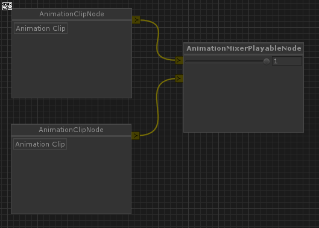
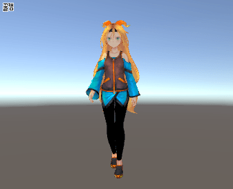

# Playerable Nodes for Node-Editor

An experiment Unity's [Playable API](https://docs.unity3d.com/Manual/Playables.html) set with [Node Editor](https://github.com/Baste-RainGames/Node_Editor). So it works on Unity 5.4.x or higher version.






Note [Node Editor](https://github.com/Baste-RainGames/Node_Editor) is added via git subtree.

The following shows the way to add [Node Editor](https://github.com/Baste-RainGames/Node_Editor) as a subtree of the current git repository. 

```
git remote add NodeEditor https://github.com/baste-RainGames/Node_Editor.git
git fetch NodeEditor
git subtree add --prefix=Assets/Plugins NodeEditor master
```

#Blending AnimatorController Demo# 

The demo can be found on [here](https://github.com/kimsama/Unity-NodeEditor-Playable/tree/master/Assets/Sample/BlendingAnimatorController)
